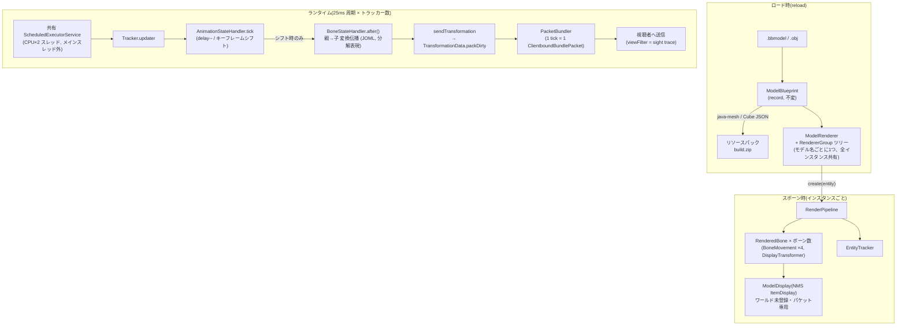
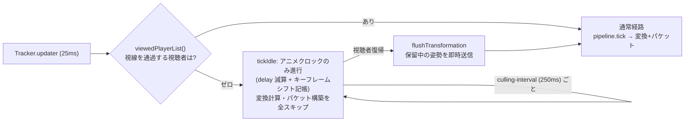

# メッシュ処理パイプライン調査レポート(フォーク版最適化)

対象: BetterModel v3 (fork base: upstream/v3, 2026-07 時点)
目標: **TPS 20 を維持したまま 1万ポリゴン級モデル 30〜50体を視界内で同時稼働**

---

## 1. 最重要の結論: サーバー負荷は「ポリゴン数」に比例しない

### 1.1 java-mesh の実体

`io.github.toxicity188:java-mesh:0.0.1`(約1,400行の小規模ライブラリ、ソースは Maven Central の
sources jar で確認)は **モデルロード時にメッシュ(.obj / Blockbench mesh 要素)を
Minecraft リソースパック JSON へ変換するビルダー**である。

- 使用箇所は `api` の blueprint 層のみ:
  - `BlueprintElement.Mesh.toShape()` — 頂点回転・UV 正規化 → `MeshShape`
  - `BlueprintElement.Group.buildMeshItemModel()` — `MeshBuilder` で三角形群を item model JSON 化
  - `BlueprintLoadContext` — テクスチャ画像の UV サンプリング用キャッシュ
- 呼び出し元は `ModelManagerImpl.reload()`(リソースパック生成時)のみ

**ランタイム(tick 経路)からは一切到達しない。** メッシュ形状・UV・テクスチャは
リソースパックとしてクライアントに配布され、サーバーには `custom_model_data` の
インデックスしか残らない。

### 1.2 帰結

| コスト | 誰が払うか | スケール因子 |
|---|---|---|
| ポリゴン描画 | クライアント GPU | ポリゴン数 × 体数 |
| ボーン変換・アニメーション | サーバー(BetterModel ワーカースレッド) | **ボーン数 × 体数 × 更新頻度** |
| Transform パケット | サーバー CPU + 帯域 | **ダーティボーン数 × 視聴者数 × 更新頻度** |
| hitbox / パッセンジャー同期 | サーバーメインスレッド | hitbox ボーン数 × 体数 |

よって「1万ポリゴン 50体」のサーバー側の実体は「(モデルのボーン数)× 50 の
item display entity 群の変換・パケット処理」であり、最適化はボーン処理と
パケット経路に集中すべき。ベンチマークもボーン数(20 vs 50)を軸に設計した
(`benchmark/README.md`)。

---

## 2. ランタイム処理フロー(調査結果)

### 2.1 全体構造



### 2.2 ボーン変換の詳細

- 変換は **Matrix4f を使わない分解表現**(`BoneMovement` = position/scale/rotation(quat)/rawRotation)
- キーフレームは ロード時に `AnimationGenerator` が **プリミティブ float 配列 (SoA)** へ焼き込み済み
  (`AnimationKeyframe.AnimationArray`)。ランタイム補間はベイク済みフレームの再生のみで
  **ホットパスのアロケーションはゼロ**(スクラッチオブジェクトへ書き込み)
- 親子伝播は「子が親を pull する再帰 + `updateAfter` フラグでメモ化」。
  1 tick に各ボーンの `after()` 本体は高々 1 回
- `lerp-frame-time: 3` のベイクにより、Transform パケットは毎 tick ではなく
  **キーフレーム境界(約 3 MCtick ≒ 6.7Hz)でのみ発生**し、クライアント側
  interpolation duration で滑らかに補間される

### 2.3 パケット経路の詳細

- ボーン display は base entity の **パッセンジャー**として mount されるため、
  位置同期パケットはボーンごとには発生しない(vanilla の乗客同期に相乗り)
- スポーン/デスポーンは vanilla の entity tracker のパケット
  (`ClientboundAddEntityPacket` / `RemoveEntities`)を Netty ハンドラで横取りして駆動
  → **ビュー距離カリングは vanilla 相当が既に効いている**
- Transform は `ClientboundSetEntityDataPacket`。ε 比較 (`MathUtil.isSimilar`) で
  translation/scale/rotation の**フィールド単位ダーティ判定**があり、無変化なら
  パケット自体を生成しない
- 1 トラッカー 1 tick 分のパケットは 1 つの `ClientboundBundlePacket` にまとまる
  (`packet-bundling-size` で分割閾値調整)。パケットオブジェクトは
  **視聴者数に関係なく 1 回だけ構築**され、全員に共有インスタンスを書き込む
- ModelEngine 互換 mod クライアントには half-float 圧縮のカスタムペイロード 1 発

### 2.4 スケジューリング

- 全トラッカー共有の `ScheduledThreadPoolExecutor`(スレッド数 = CPU×2)で
  **25ms(40Hz)周期、メインスレッド外**
- 視聴者ゼロのトラッカーは自動 shutdown(アニメーションも完全停止)
- つまり TPS への直接寄与は hitbox/スクリプト同期タスク程度で、
  主戦場は**ワーカースレッドの CPU 飽和と GC・パケット帯域**
  → ベンチ計測はメインスレッド MSPT に加えて
  `BetterModel-Worker-*` スレッド CPU を必須項目とした

---

## 3. 既存最適化の棚卸し(upstream 実装済みだったもの)

| 項目 | 実装 | 場所 |
|---|---|---|
| 静的データ共有 | Blueprint/RendererGroup/キーフレーム配列は全インスタンス共有。コピーは per-bone のスクラッチのみ | §4 参照 |
| ダーティフラグ | `updateAfter`/`updateCurrent`(ボーン状態)、keyframe 同一性、ε 比較(NMS)、多層で実装済み | RenderedBone / EntityData |
| 視聴者ゼロ停止 | `playerCount()==0` → スケジューラ停止 | Tracker |
| 視線カリング | `sightTrace`(距離 + 視野コーン判定)**ただしパケット送信のみ抑制** | EntityUtil.canSee |
| パケットバンドル | 1 tick 1 bundle + サイズ分割 | PacketBundlers |
| クライアント補間活用 | キーフレーム境界のみ送信 + interpolation duration | AnimationStateHandler |

**ギャップ(フォークで埋めたもの)**:

1. 視線カリングが**送信だけ**を抑制し、変換計算・パケット構築は全視聴者が
   視界外でも 40Hz で回り続けていた
2. 距離ベースの更新間引き(LOD)が存在しない — 遠距離でも 25ms 周期
3. `transformation_interpolation_duration` が毎パケット再送されていた
   (lerp-frame ベイクでは値がほぼ常に一定なのに)
4. 視線判定 (`canSee`) が同一 tick 内で「送信判定」に重複実行されうる

---

## 4. 静的データ共有の確認(最適化タスク4 → 対応不要と判定)

スポーン時にインスタンスへコピーされるのは:

- `RenderedBone` ごとの `BoneMovement` スクラッチ(vec3×2 + quat)と
  `BoneStateHandler`(before/after/current の 3 つ + キャッシュ)
- `TransformedItemStack` のオフセットベクトル(`copy()`)
- アニメーション開始時の `AnimationIterator`(**共有配列への index のみ保持**)

形状・UV・テクスチャ・キーフレーム float 配列・ボーン階層定義はすべて共有参照であり、
**重複コピーは存在しない**。ここに最適化の余地はない(確認のみで完了)。

---

## 5. フォークで実装した最適化

### 5.1 計算カリング(最優先・実装済み)

`performance.animation-culling`(デフォルト有効)。



設計上の要点:

- **アニメーションクロックは止めない**(`delay` 減算とキーフレームシフトの記帳のみ実行)。
  攻撃アニメの発火タイミング等ゲームプレイへの影響を避ける。スキップするのは
  親子変換計算(`after()`)・IK・パケット構築という高コスト部分だけ
- culled 中は 25ms → `culling-interval`(デフォルト 10 フレーム = 250ms)の
  ハートビートに減速し、経過フレーム数をまとめて 1 回でキャッチアップ
- culled 中も `EntityTracker.onCulledTick()` で位置追跡だけは更新
  (視線判定が古い位置に対して行われ続けるのを防ぐ)
- 復帰時は `flushTransformation` で保留姿勢を即送信 + `forceUpdate` 貫通
  (`readyForForceUpdate` が立っている tick はカリングを貫通する)
- 出現遅延の上限 = ハートビート間隔(デフォルト 250ms)。
  `culling-interval` で精度とコストのトレードを調整可能

### 5.2 距離 LOD(実装済み)

`performance.lod`(デフォルト有効)。最寄りの「視線を通過している視聴者」までの
距離で更新間隔を段階化:

| 最寄り視聴者距離 | 更新間隔(デフォルト設定) |
|---|---|
| < 16 blocks | 25ms(フル、40Hz) |
| 16〜48 blocks | 50ms → 100ms(2の冪で段階化) |
| ≥ 48 blocks | 200ms(`lod-max-interval: 8`) |

- 間引いたフレームは `AnimationStateHandler.tick(frames)` の**キャッチアップ走行**で
  一括消化するため、アニメーションの実時間速度は変わらない
  (期限切れキーフレームを最大 8 個までまとめてシフトし、余剰 delay を持ち越す)
- 送信時は interpolation duration に **LOD 間隔の床値**を適用
  (`minInterpolationDuration`)。クライアントが更新ギャップ全体を補間するため、
  遠距離でもカクつかない。skip-interpolation(スナップ)指定は尊重して床値を適用しない
- 「視界内に 50体全部いる」ケースでも、大半が中遠距離であれば
  変換・パケットの実行回数が 1/4〜1/8 に落ちる

### 5.3 視線判定の重複排除(実装済み)

`viewedPlayerList()` が tick 冒頭で視線判定を**視聴者ごとに 1 回だけ**評価し、
カリング判定・LOD 距離計算・パケット送信の全てで同じスナップショットを使い回す。
(従来は判定用と送信用で `canSee` が二重評価される構造だった)

### 5.4 パケット差分の強化(実装済み)

`transformation_interpolation_duration` の DataValue を**前回送信値から変化した
場合のみ**同梱するよう全 NMS モジュール(v1_21_R3〜v26_R2)を変更。
lerp-frame ベイクでは duration がほぼ一定のため、実質**毎 Transform パケットで
エントリ 1 個分(タグ+VarInt)の帯域と DataValue アロケーション 1 個を削減**。
mod クライアント経路(ModelEngine bulk payload)はフィールドマスク仕様を変えないため従来通り。

### 5.5 Vector API (SIMD) — 早期切り捨て(タスク5)

**採用しない。** 根拠:

1. 変換表現が Matrix4f ではなく pos/quat/scale の分解表現で、演算列が短く分岐が多い。
   複数エンティティ分の水平バッチ化には AoS→SoA の詰め替えが必要で、詰め替えコストが
   演算削減を食う規模(ボーンあたり十数 FLOP)
2. ダーティゲートにより変換演算はキーフレーム境界(6.7Hz)でしか走らず、
   プロファイル上の支配項になりにくい(支配項はパケット構築とスレッド調整)
3. `jdk.incubator.vector` は起動フラグ(`--add-modules`)必須で、
   プラグイン配布形態と相性が悪い

計測でボーン演算が支配項と判明した場合のみ再検討する(その場合も先に
LOD 間隔と `lerp-frame-time` の調整で演算回数自体を減らすほうが効く)。

---

## 6. 設定リファレンス(フォーク追加分)

```yaml
# config.yml
performance:
  animation-culling: true   # 視線外カリング(計算スキップ)
  culling-interval: 10      # culled 中のハートビート(フレーム数 ×25ms)
  lod: true                 # 距離ベース更新間引き
  lod-near-distance: 16     # これ未満はフルレート
  lod-far-distance: 48      # これ以上は最遅レート
  lod-max-interval: 8       # 最遅間隔(フレーム数、2の冪、最大16)
```

既存の関連設定: `sight-trace` / `max-sight` / `min-sight`(視線判定)、
`lerp-frame-time`(キーフレーム密度 = 送信レートの上限)、`packet-bundling-size`。

## 7. 既知のトレードオフ

- culled 中は hitbox のボーン相対オフセットが凍結する(base entity 追従は継続)。
  誰の視界にも入っていない間の話であり実用上の影響は小さい
- ダメージティントの減衰カウントが LOD 間引きの影響で遠距離ほど長持ちする(視覚のみ)
- 視聴者が視線外→内へ復帰した際、`animation-culling` 無効時代と同様に
  次のキーフレーム境界までは最終送信姿勢が表示される(`flushTransformation` で
  保留分は即時送信される。完全な静的モデルは差分ゼロのため元々送信されない)
- upstream 由来の既知挙動: フィールド単位ダーティ送信のため、視線外で
  値が 1 回だけ変化したフィールドは復帰後も次の変化まで再送されない
  (duration 差分化で同族の挙動が duration にも及ぶ。実害は補間時間のずれのみ)

## 8. 次のアクション

1. `benchmark/README.md` のシナリオ・マトリクスで Before/After を計測
   (`performance.*` を off にすると upstream 相当に戻せる)
2. `cpu_bm_worker_ms` / `cpu_netty_ms` / `alloc_mb_s` の内訳で次の優先度を決定
   - ボーン演算支配 → `lerp-frame-time` 増加、LOD 帯域の距離を詰める
   - パケット支配 → バンドルサイズ調整、per-viewer 差分送信の検討
   - GC 支配 → JFR `jdk.ObjectAllocationSample` で発生源特定
     (候補: `DataValue`/`ArrayList` per packet、`Appender` クロージャ連鎖)
